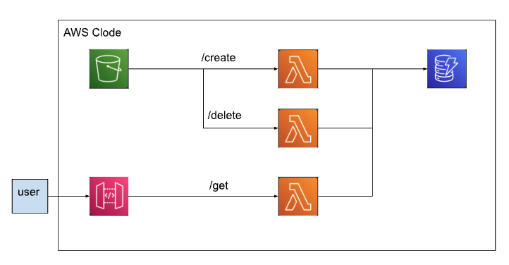

<h1>S3 Events</h1>

In this project, we are going to create a serverless application 
by using s3, lambda, dynamodb, and api. 

We will design the app as a micro service. This means that 
all the lambda functions needed for the application will be included in the template.yaml file (within the same application).

<h2>Requirements</h2>

<ul>
    <li>On file upload to s3, a record is added to dynamodb.</li>
    <li>On file delete from s3, the corresponding record is deleted from dynamodb.</li>
    <li>User is able to access a record in dynamodb using api gateway providing file id. Api requires an api key.</li>
</ul>

Cloud9 is used to create and deploy the SAM Application. The project files are in the environment folder. Refer to the hello-world project
for more information on how to use Cloud9 to develop SAM applications.

<h2>Architecture</h2>
The following diagram describes the architecture. 

<h2>Implementation</h2>
Important files
<table>
    <tr><th>File</th><th>Description</th></tr>
    <tr>
        <td>template.yaml</td>
        <td>Serverless application architectural definition</td>
    </tr>
    <tr>
        <td>create/app.mjs</td>
        <td>create lambda handler</td>
    </tr>
    <tr>
        <td>delete/app.mjs</td>
        <td>delete lambda handler</td>
    </tr>
    <tr>
        <td>get_/app.mjs</td>
        <td>get lambda handler</td>
    </tr>
</table>