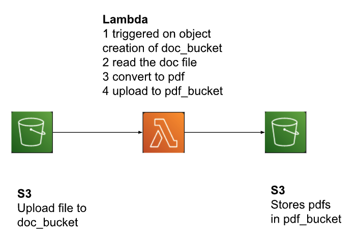

<h1>Word to Pdf on S3 Event</h1>
<h2>System Design</h2>
In this project we are going to convert a word file to pdf on upload to s3.

<h2>Lambda function</h2>
See the lambda_function.py.
<h2>Install dependencies</h2>

We are going to deploy dependencies as a lambda layer.
In the project folder create a folder called ‘python’ and install the dependencies in the python folder. Lambda requires the python dependencies in the ‘python’ folder. 

Libreoffice package works with python 3.8. Therefore we need to install dependencies for python 3.8.

If the dependency layer has platform compatibility issues, generate the dependencies on Amazon Linux 2 Cloud9 instance.

install aws python sdk

<code>
<pre>
pip3 install \
--target=python \
--implementation cp \
--python-version 3.8 \
--only-binary=:all: --upgrade \
boto3

</pre>
</code>

install brotlipy used to extract the libreoffice package.

<code>
<pre>
pip3 install \
--target=python \
--implementation cp \
--python-version 3.8 \
--only-binary=:all: --upgrade \
brotlipy

</pre>
</code>
<h2>Generate dependency layer and function zip files</h2>
<code>
<pre>
zip -r layer.zip python

zip fn.zip lambda_function.py
</pre>
</code>
<h2>Libreoffice layer</h2>

Option1: using prebuilt layer  
Option2: download the lo.tar.br from the following link and create a zip file to create a layer. 

<code>
<pre>
https://github.com/vladholubiev/serverless-libreoffice/releases/tag/v6.4.0.1
https://medium.com/analytics-vidhya/convert-word-to-pdf-using-aws-lambda-cb111be0d685
</pre>
</code>
<h2>AWS Configurations</h2>
<h3>S3</h3>

Create the doc_bucket. 
Create the pdf_bucket.

<h3>Lambda configurations</h3>

Create the lambda function.

<h4>Execution role</h4>

Lambda function’s execution role should have read access to the doc_bucket and write access to the pdf_bucket. Or it can have full s3 access.

<h4>S3 Trigger</h4>

Add a lambda trigger where the source is the doc_bucket and the destination is the lambda function. 

<h4>Timeout</h4>

<pre>With 4GB memory, 
Exe time with cold start time: 12 sec
Exe time with warm start: 2 sec
Therefore 1 min of timeout should be sufficient.
</pre>

<h4>Memory</h4>

Office extraction is done in memory. Office package size is 370 Mb. Therefore,
the memory has to be > 512 MB. When increasing memory, execution time
improved until 4GB. After that no improvement. Therefore, set the memory
to 4GB.

<h4>Provisioned concurrency</h4>

Provision at least one instance to achieve a warm start. With provisioned
concurrency, we can eliminate the libreoffice extraction for the requests
after the first request.

<h2>Test</h2>

Upload a doc file to the doc_bucket and check if the pdf file appears in the pdf_bucket.

