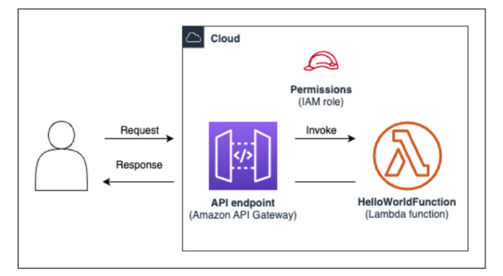

<h1>Hello world app (SAM CLI, Python)</h2>
<h2>Install AWS SAM CLI</h2>
Download the package installer.  
Run the downloaded installer.  

Verify the installation  
<code>
<pre>
which sam
sam –version
</pre>
</code>
<h2>System Design</h2>

<h2>Initialize</h2>
In the project folder run the following command.  
<code>
sam init
</code>
 
Choose the following configurations.
<table>
    <tr>
        <th>Configuration</th>
        <th>Description</th>
    </tr>
    <tr>
        <td>Template type</td>
        <td>Quick Start Template</td>
    </tr>
    <tr>
        <td>Template</td>
        <td>Hello world</td>
    </tr>
    <tr>
        <td>Runtime and package type: python and zip</td>
        <td>No</td>
    </tr>
    <tr>
        <td>Runtime</td>
        <td>Python3.11</td>
    </tr>
    <tr>
        <td>Package</td>
        <td>Image</td>
    </tr>
    <tr>
        <td>Enable X-Ray tracing</td>
        <td>Yes</td>
    </tr>
    <tr>
        <td>Enable CloudWatch</td>
        <td>Yes</td>
    </tr>
    <tr>
        <td>Project Name</td>
        <td>test-sam</td>
    </tr>
</table>
 
Main files in the test-app folder 

<b>hello_world/app.py</b> – Contains your Lambda function code. 

<b>hello_world/requirements.txt</b> – Contains any Python dependencies that your Lambda function requires. 

<b>samconfig.toml</b> – Configuration file for your application that stores default parameters used by the AWS SAM CLI. 

<b>template.yaml</b> – The AWS SAM template that contains your application infrastructure code. 

<h2>Build</h2>
<code>
<pre>
cd test-sam
sam build
</pre>
</code>
<h2>Deploy</h2>
<code>
<pre>
sam deploy --guided
</pre>
</code>

Use the following configurations.  
<table>
    <tr>
        <th>Configuration</th><th>Description</th>
    </tr>
    <tr>
        <td>stack name</td><td>test</td>
    </tr>
    <tr>
        <td>region</td><td>us-west-1</td>
    </tr>
    <tr>
        <td>confirm changes before deploy</td><td>y</td>
    </tr>
    <tr>
        <td>Allow SAM CLI IAM role creation</td><td>y</td>
    </tr>
    <tr>
        <td>Disable rollback</td><td>n</td>
    </tr>
    <tr>
        <td>HelloWorldFunction has no authentication. Is this okay</td><td>y</td>
    </tr>
    <tr>
        <td>Save arguments to configuration file</td><td>y</td>
    </tr>
    <tr>
        <td>SAM configuration file [samconfig.toml]</td><td>enter to accept</td>
    </tr>
    <tr>
        <td>SAM configuration environment [default]</td><td>enter to accept</td>
    </tr>
</table>

<h2>Test with Postman</h2>
copy the API gateway endpoint url. 
Its in API Gateway/API:test/Stages/Prod/hello/get 

Api name = the stack name that we choose  
Deployment process creates 2 api stages: prod and stage 
Send a request from postman and check if the CloudWatch logs appear.

<h2>Delete</h2>
<code>
sam delete --stack-name test
</code>
