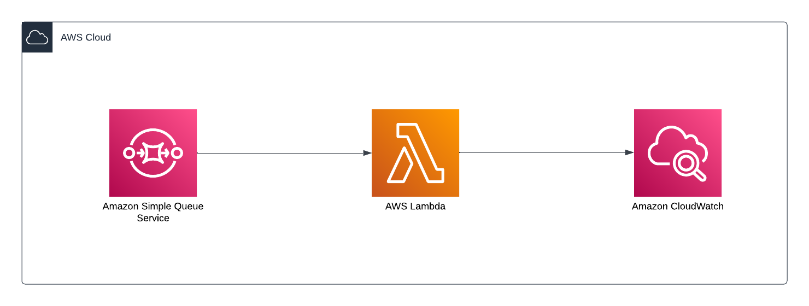

<h1>Trigger lambda by sqs (SAM)</h1>
<h2>System Design</h2>

<h2>Initialize</h2>
Change directory into the project folder and run the following command. 
<code>
sam init
</code>
<table>
    <tr>
        <th>Configuration</th>
        <th>Description</th>
    </tr>
    <tr>
        <td>Template type</td>
        <td>Quick start template</td>
    </tr>
    <tr>
        <td>Template</td>
        <td>Hello world</td>
    </tr>
     <tr>
        <td>Run time and package type: python and zip</td>
        <td>No</td>
    </tr>
     <tr>
        <td>Runtime</td>
        <td>Python3.11</td>
    </tr>
     <tr>
        <td>Package type</td>
        <td>Image</td>
    </tr>
     <tr>
        <td>Enable xray</td>
        <td>Yes</td>
    </tr>
     <tr>
        <td>Enable CloudWatch</td>
        <td>Yes</td>
    </tr>
     <tr>
        <td>Project Name</td>
        <td>test-sqs</td>
    </tr>
</table>
 
Main files 

<table>
    <tr>
        <th>File</th>
        <th>Description</th>
    </tr>
    <tr>
        <td>hello_world/app.py</td>
        <td>Contains your Lambda function code</td>
    </tr>
    <tr>
        <td>hello_world/requirements.txt</td>
        <td>Contains any Python dependencies that your Lambda function requires.</td>
    </tr>
    <tr>
        <td>samconfig.toml</td>
        <td>Configuration file for your application that stores default parameters used by the AWS SAM CLI.</td>
    </tr>
    <tr>
        <td>template.yaml</td>
        <td>The AWS SAM template that contains your application infrastructure code</td>
    </tr>
</table>

<h2>Refactor the project</h2>
Then change the labels on the template.yaml and code folder name. 

Remove the api event of the lambda function. Then remove the api from the output section. 

Add SQS event to the lambda function.  
<code>
<pre>
Events:
       SQSEvent:
         Type: SQS
         Properties:
           Queue: !GetAtt TestSqsQueue.Arn
           BatchSize: 1
           MaximumBatchingWindowInSeconds: 0
</pre>
</code>

 
Then define the SQS resource. 

<code>
<pre>
TestSqsQueue:
   Type: AWS::SQS::Queue
   Properties:
     #if the queue name is not set, the auto generated queue name has the following format
     #stackName-queueResourceName-randomCode
     QueueName: TestSqs-q
     #visibility timeout = (function timeout * 6) + batch window
     #if batch window = 0 and function timeout = 3 s
     #visibility timeout = 3 * 6 = 18s
     #The batch window is set when creating a lambda trigger.
     VisibilityTimeout: 18
     MessageRetentionPeriod: 60 #in seconds
</pre>
</code>

 
Update handler to log the sqs massage. 
<code>
<pre>
import json
def lambda_handler(event, context):
   print(event['Records'][0]['body'])
   return {
       "statusCode": 200,
       "body": json.dumps(
           {
               "message": event['Records'][0]['body'],
           }
       ),
   }
</pre>
</code>
<h2>Build</h2>
<code>
cd test-sqs
sam build
</code>

<h2>Deploy</h2>
<code>
sam deploy --guided
</code>

 
<table>
    <tr>
        <th>Configuration</th>
        <th>Description</th>
    </tr>
    <tr>
        <td>Stack name</td>
        <td>testsqs</td>
    </tr>
    <tr>
        <td>AWS Region</td>
        <td>us-west-1</td>
    </tr>
    <tr>
        <td>confirm changes before deploy</td>
        <td>y</td>
    </tr>
    <tr>
        <td>Allow SAM CLI IAM role creation</td>
        <td>y</td>
    </tr>
    <tr>
        <td>Disable rollback</td>
        <td>n</td>
    </tr>
    <tr>
        <td>Save arguments to configuration file</td>
        <td>y</td>
    </tr>
    <tr>
        <td>SAM configuration file [samconfig.toml]</td>
        <td>enter to accept</td>
    </tr>
    <tr>
        <td>SAM configuration environment [default]</td>
        <td>enter to accept</td>
    </tr>
</table>

<h2>Test</h2>

Send a message to the queue and check if the log appears on the CloudWatch.

<h2>Delete</h2>
<code>
sam delete --stack-name testsqs
</code>