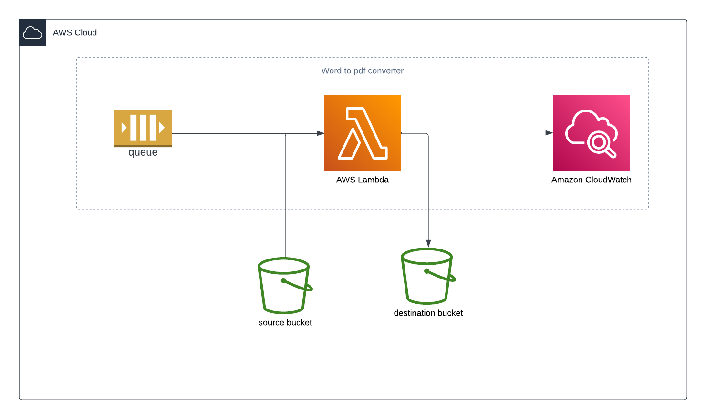

<h1>Trigger lambda by sqs (SAM)</h1>
<h2>System Design</h2>

<ol>
    <li>
        submit a message to the queue. The message should include the key of the doc file to be converted to pdf.
    </li>
    <li>
        The lambda function downloads the doc file from the source s3 bucket.
    </li>
    <li>
        The lambda function converts the doc file to a pdf.
    </li>
    <li>
        The pdf file is uploaded to the destination bucket.
    </li>
</ol>

<h2>Initialize</h2>
Change directory into the project folder and run the following command. 
<code>
sam init
</code>
<table>
    <tr>
        <th>Configuration</th>
        <th>Description</th>
    </tr>
    <tr>
        <td>Template type</td>
        <td>Quick start template</td>
    </tr>
    <tr>
        <td>Template</td>
        <td>Hello world</td>
    </tr>
     <tr>
        <td>Run time and package type: python and zip</td>
        <td>No</td>
    </tr>
     <tr>
        <td>Runtime</td>
        <td>Python3.11</td>
    </tr>
     <tr>
        <td>Package type</td>
        <td>Image</td>
    </tr>
     <tr>
        <td>Enable xray</td>
        <td>Yes</td>
    </tr>
     <tr>
        <td>Enable CloudWatch</td>
        <td>Yes</td>
    </tr>
     <tr>
        <td>Project Name</td>
        <td>test-sqs</td>
    </tr>
</table>
 
Main files 

<table>
    <tr>
        <th>File</th>
        <th>Description</th>
    </tr>
    <tr>
        <td>hello_world/app.py</td>
        <td>Contains your Lambda function code</td>
    </tr>
    <tr>
        <td>hello_world/requirements.txt</td>
        <td>Contains any Python dependencies that your Lambda function requires.</td>
    </tr>
    <tr>
        <td>samconfig.toml</td>
        <td>Configuration file for your application that stores default parameters used by the AWS SAM CLI.</td>
    </tr>
    <tr>
        <td>template.yaml</td>
        <td>The AWS SAM template that contains your application infrastructure code</td>
    </tr>
</table>

<h2>Refactor the project</h2>
Then change the labels on the template.yaml and code folder name. 

Remove the api event of the lambda function. Then remove the api from the output section. 
<h2>Template.yaml</h2>
<h3>Lambda</h3>
Memory: 4096 MB  
Timeout: 60s  

Lambda SQS Trigger configurations  
Batch size: 1    
Batch window: 0  

<code>
<pre>
TestSamFunction:
   Type: AWS::Serverless::Function # More info about Function Resource: https://github.com/awslabs/serverless-application-model/blob/master/versions/2016-10-31.md#awsserverlessfunction
   Properties:
     PackageType: Image
     #if function name is not given, auto generated function name has the following format
     #stackName-ResourceName-randomCode
     FunctionName: TestSam-fn
     MemorySize: 4096 #in MB
     Timeout: 60 #in Seconds
     Architectures:
     - x86_64
     #trigger lambda by sqs queue
     Events:
       SQSEvent:
        Type: SQS
        Properties:
          Queue: !GetAtt TestSamQueue.Arn
          BatchSize: 1
          MaximumBatchingWindowInSeconds: 0
   #give lambda access to read from the source bucket and write to the destination bucket
   Connectors:
     SrcConn:   #read access to the src bucket
       Properties:
         Destination:
           Type: AWS::S3::Bucket
           Arn: arn:aws:s3:::test-src
         Permissions:
           - Read
     DestConn:   #write access to the dest bucket
       Properties:
         Destination:
           Type: AWS::S3::Bucket
           Arn: arn:aws:s3:::test-dest
         Permissions:
           - Write
   Metadata:
     Dockerfile: Dockerfile
     DockerContext: ./fn
     DockerTag: python3.11-v1
</pre>
</code>
<h3>SQS</h3>
visibility timeout = (function timeout * 6) + batch window  
if batch window = 0      
function timeout = 60 s  

visibility timeout = 60 * 6 = 360s     

Message retention period: 900 seconds  

<code>
<pre>
TestSamQueue:
  Type: AWS::SQS::Queue
  Properties:
    #if the queue name is not set, the auto generated queue name has the following format
    #stackName-queueResourceName-randomCode
    QueueName: TestSam-q
    #visibility timeout = (function timeout * 6) + batch window
    #if batch window = 0 and function timeout = 60 s
    #visibility timeout = 60 * 6 = 360s
    #The batch window is set when creating a lambda trigger.
    VisibilityTimeout: 360
    MessageRetentionPeriod: 900 #in seconds.  15mim
</pre>
</code>

 
Then define the SQS resource. 

<code>
<pre>
TestSqsQueue:
   Type: AWS::SQS::Queue
   Properties:
     #if the queue name is not set, the auto generated queue name has the following format
     #stackName-queueResourceName-randomCode
     QueueName: TestSqs-q
     #visibility timeout = (function timeout * 6) + batch window
     #if batch window = 0 and function timeout = 3 s
     #visibility timeout = 3 * 6 = 18s
     #The batch window is set when creating a lambda trigger.
     VisibilityTimeout: 18
     MessageRetentionPeriod: 60 #in seconds
</pre>
</code>
<h2>Dockerfile</h2>
<ol>
    <li>
        update the package manager and install the packages needed by the libreoffice.
    </li>
    <li>
        download and extract libreoffice
    </li>
    <li>
        install libreoffice
    </li>
    <li>
        install requirement
    </li>
    <li>
        define the handler and the HOME env variable.
    </li>
</ol>
 
<code>
<pre>
FROM public.ecr.aws/lambda/python:3.11

COPY app.py requirements.txt ./

RUN python3.11 -m pip install -r requirements.txt -t .

CMD ["app.lambda_handler"]

#libreoffice setup

#install supporting packages for installing and running libreoffice
#New lambda base images use dnf instead of yum
RUN yum -y update \
    && yum clean all \
    && yum -y install wget java tar gzip libXinerama cairo cups

#download libreoffice and unpack libreoffice
#make sure the package exists. If it does not exist, use a diffirent package. 
#if the package is different, update the extracted file names accordingly.
RUN cd /tmp \
    && wget https://download.documentfoundation.org/libreoffice/stable/7.6.3/rpm/x86_64/LibreOffice_7.6.3_Linux_x86-64_rpm.tar.gz \
    && tar xvf LibreOffice_7.6.3_Linux_x86-64_rpm.tar.gz
    
#show extracted package
RUN cd /tmp \
    && ls
    
#install libreoffice
RUN cd /tmp/LibreOffice_7.6.3.2_Linux_x86-64_rpm/RPMS/ \
    && rpm -Uvh *.rpm
    
#clean up
RUN cd /tmp
RUN rm -rf LibreOffice_7.6.3.2_Linux_x86-64_rpm 
RUN rm -rf LibreOffice_7.6.3_Linux_x86-64_rpm.tar.gz 

#HOME is where libreoffice7.6 is run by the python script. 
#lambda has permission to /tmp
ENV HOME=/tmp
</pre>
</code>
 
<h2>Requirements.txt</h2>
<code>
requests
boto3
</code>

<h2>Handler</h2>
<ol>
    <li>
    Downloads the doc file based on the information in the SQS message.
    </li>
    <li>
    convert the doc file to pdf using libreoffice.
    </li>
    <li>
    upload the converted pdf file to the destination bucket.
    </li>
</ol>

 
<code>
<pre>
import os
import boto3
import subprocess
import json
destination_bucket = 'test-dest-23'

def download_from_s3(bucket, key, download_path):
    s3 = boto3.client("s3")
    s3.download_file(bucket, key, download_path)

def upload_to_s3(file_path, bucket, key):
    s3 = boto3.client("s3")
    s3.upload_file(file_path, bucket, key)

def convert_word_to_pdf(word_file_path, output_dir):
    conv_cmd = f"libreoffice7.6 --headless --invisible --nodefault --view --nolockcheck --nologo --norestore --convert-to pdf --outdir {output_dir} {word_file_path}"

    response = subprocess.run(conv_cmd.split(), stdout=subprocess.PIPE, stderr=subprocess.PIPE)

    if response.returncode != 0:
        return False
    return True

def lambda_handler(event, context):
    event_body = event['Records'][0]['body']
    event_body = json.loads(event_body)
    if 'bucket' not in event_body:
        print('The bucket is not in the sqs message')
        return

    if 'key' not in event_body:
        print('Ket is not in the SQS message')
        return

    bucket = event_body['bucket']
    key = event_body['key']

    key_prefix, base_name = os.path.split(key)
    download_path = f"/tmp/{base_name}"
    output_dir = "/tmp"
    file_name, ext = os.path.splitext(base_name)

    download_from_s3(bucket, key, download_path)

    is_converted = convert_word_to_pdf(download_path, output_dir)

    if is_converted:
        upload_key = ''
        if key_prefix:
            upload_key = f"{key_prefix}/{file_name}.pdf"
        else:
            upload_key = f"{file_name}.pdf"

        upload_to_s3(f"{output_dir}/{file_name}.pdf", destination_bucket, upload_key)
        print('Pdf was uploaded successfully')
    else:
        print('Error when converting to pdf')
</pre>
</code>

<h2>Build</h2>
<code>
cd test-sqs
sam build
</code>

<h2>Deploy</h2>
<code>
sam deploy --guided
</code>

 
<table>
    <tr>
        <th>Configuration</th>
        <th>Description</th>
    </tr>
    <tr>
        <td>Stack name</td>
        <td>testsqs</td>
    </tr>
    <tr>
        <td>AWS Region</td>
        <td>us-west-1</td>
    </tr>
    <tr>
        <td>confirm changes before deploy</td>
        <td>y</td>
    </tr>
    <tr>
        <td>Allow SAM CLI IAM role creation</td>
        <td>y</td>
    </tr>
    <tr>
        <td>Disable rollback</td>
        <td>n</td>
    </tr>
    <tr>
        <td>Save arguments to configuration file</td>
        <td>y</td>
    </tr>
    <tr>
        <td>SAM configuration file [samconfig.toml]</td>
        <td>enter to accept</td>
    </tr>
    <tr>
        <td>SAM configuration environment [default]</td>
        <td>enter to accept</td>
    </tr>
</table>

<h2>Test</h2>

Send a message to the queue and check if the log appears on the CloudWatch.

SQS Message Format 
<code>
{"bucket":"test-src", "key":"test.docx"}
</code>

<h2>Delete</h2>
<code>
sam delete --stack-name testsqs
</code>