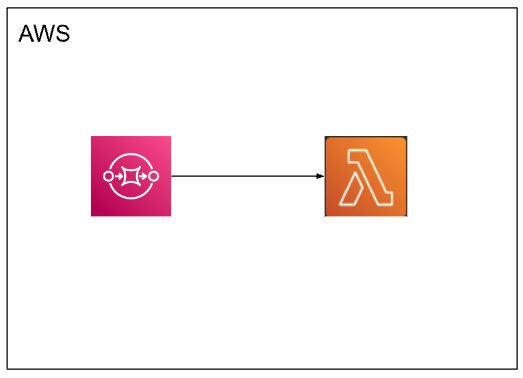

<h1>Trigger lambda by sqs</h1>
<h2>System Design</h2>
This is an example of triggering a lambda function by using a sqs queue.

<h2>Configure SQS</h2>

Create a SQS queue called test-queue.   

<code>
<pre>
visibility timeout = (function timeout * 6) + batch window

if batch window = 0
function timeout = 5 s

visibility timeout = 5 * 6 = 30s
</pre>
</code>

Leave the delivery delay and receive message wait time to 0.

<h2>Configure Lambda</h2>

Create a lambda function

<code>
<pre>
import json

def lambda_handler(event, context):
    print(event['Records'][0]['body'])
</pre>
</code>
<h2>Lambda trigger</h2>

Add trigger (chose SQS)  
Choose the previously created test queue.  
<code>
<pre>
set 
batch size = 1
batch window = 0
</pre>
</code>

<h2>Test</h2>
Send a message to the sqs queue.  
Check if the logs of lambda are available in the CloudWatch logs.
