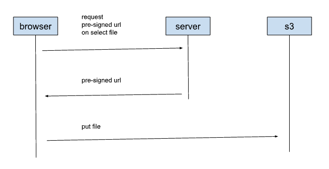

<h1>Upload file to s3</h1>
<h2>System Design</h2>

<h2>S3 Configuration</h2>
Create a bucket.  
name: test-upload  

<h3>CORS</h3>
CORS should be configured even for private buckets to allow file upload to a domain which is different from the domain the page originated. The browser is required to do a CORS check with the upload url. 

Edit CORS and allow enabled Cross origin resource sharing with the following json 

<code>
<pre>
[
    {
        "AllowedHeaders": [
            "Authorization"
        ],
        "AllowedMethods": [
            "PUT",
            "POST",
            "GET"
        ],
        "AllowedOrigins": [
            "*"
        ],
        "ExposeHeaders": []
    }
]
</pre>
</code>

<h2>App code</h2>
html 

<code>

</code>

 
js 

<code>
<pre>
import React from 'react';
import {createRoot} from "react-dom/client";
import FileUploader from "./FileUploader";

let rootElement = document.getElementById(this.elementId);
let root = createRoot(rootElement);
let uploadPolicyUrl = 'backend url';
root.render(<FileUploader uploadPolicyUrl={uploadPolicyUrl}/>);
</pre>
</code>