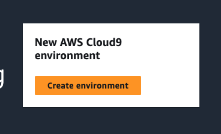
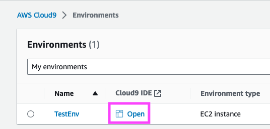
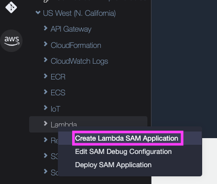
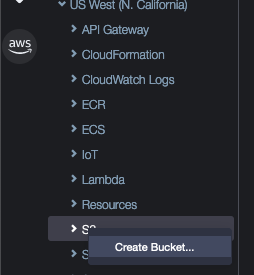
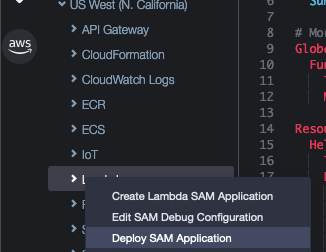

<h1>Lambda Hello World With SAM & Cloud9</h1>
In this project, we are going to create a lambda function with SAM and call it by its API endpoint. 

We will be using Cloud9 to create and deploy the SAM Application. 

<h2>Create Cloud9 Environment</h2>

    In AWS Console, go to cloud9 and create environment. 
    

    Create Environment Form
    <ul>
        <li>Name: TestEnv</li>
        <li>Environment type: EC2 Instance</li>
        <li>Instance type: t2.micro (for testing)</li>
        <li>Platform: Amazon Linux 2</li>
        <li>Timeout: 30min</li>
        <li>Connection: ssh</li>
    </ul>

Click Create

<h2>Create Lambda SAM Application</h2>

   
    Open IDE.  
     

    On the AWS Explorer, add region. The SAM Application will be created under this region. 
     

    Write click on the lambda and choose 'Create Lambda SAM Application'. It will take a few seconds to appear the application create wizard. 
     

<table>
    <tr>
        <td>Select SAM Application Runtime:</td><td>nodejs18.x</td>
    </tr>
    <tr>
        <td>Select Architecture</td><td>Example: x86_64</td>
    </tr>
    <tr>
        <td>Select SAM Application Template:</td><td>Hello World App</td>
    </tr>
    <tr>
        <td>Select the folder for your new SAM Application:</td><td>TestEnv</td>
    </tr>
    <tr>
        <td>Enter a name for your new application:</td><td>TestApp</td>
    </tr>
</table>
    In the test-env folder, "test-app" folder is created. 
    To delete the app, right click on the test-app and choose delete. After deploying the app the deployment should be deleted via the CloudFormation stack.

<h2>Test Lambda SAM Application Locally</h2>

    Run the app by pressing the Green Run button at the top of the IDE. Before running make sure that the "TestApp:HelloWorldFunction.." is selected as the run file. 

    Run the following command on the bash window to generate payload.  
    <code>sam local generate-event s3 put</code>  
    copy the payload including {} 
    Open launch.json file. Locate the lambda payload option. Then update it as follows. 
    <code>
    "lambda": {
        "payload": {"json": past_the_payload}
    }
    </code>  
    Save the file.  
    Open app.js file add console.log(event) after the try catch block. Save the app.js file and run the application to test the s3 event locally. On the AWS Toolkit window, we can see the s3 put payload logged by the console.log command.

<h2>Deploy Lambda SAM Application</h2>

We want to refactor the naming of the hello world project to match the naming of our project. If we refactor and deploy, the deployment will fail. If we first deploy, refactor, then sync the local changes, it will work.
Then write click on s3, and create the deployment bucket called 'testapp-deployment'. 
 

Then write click on lambda and deploy SAM Application. 
 

<table>
    <tr>
        <th>Option</th><th>Value</th>
    </tr>
    <tr>
        <td>yaml</td><td>TestApp/template.yaml</td>
    </tr>
    <tr>
        <td>deployment bucket</td><td>testapp-deployment</td>
    </tr>
    <tr>
        <td>deployment stack name</td>
        <td>
            TestApp 
            This is the CloudFormation name.  
            The stack name will be prepended to all the resources created. 
            To delete the application, delete the CloudFormation.
        </td>
    </tr>
</table>

Once the deployment is completed, in lambda console, notice that there is a function with a name like this.  
TestApp-HelloWorldFunction-id 

To test if the function work, on the lambda console, navigate to TestApp-HelloWorldFunction-id/API Gateway. Then copy the api endpoint. Access it with the browser. It should display "hello world".

<h2>Important Project Files</h2>

    <table>
        <tr>
            <th>File</th><th>Description</th>
        </tr>
        <tr>
            <td>TestEnv/TestApp/hello-world/app.js</td><td>Lambda function</td>
        </tr>
        <tr>
            <td>TestEnv/.c9/launch.json</td><td>app local launch configurations</td>
        </tr>
        <tr>
            <td>TestEnv/TestApp/template.yaml</td><td>app deployment configuration</td>
        </tr>
    </table>

<h2>Update lambda and re-deploy</h2>

We would want to update lambda. For example, in cloud9 IDE, open TestApp/hello-world/app.mjs. Then update the "hello world" message to "hello world 2".

The most strait forward way is to delete the cloud formation stack and deploy the app as we did before.

