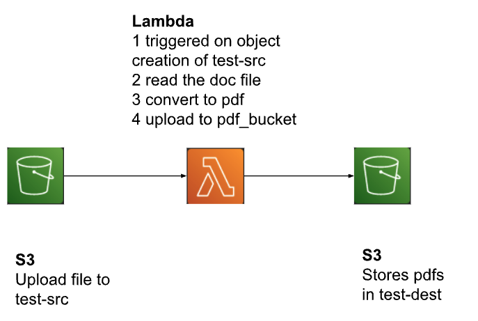

<h1>Word to pdf conversion by libreoffice container deployed on aws lambda function-on s3 trigger</h1>

In this project, we are going to convert a doc file to pdf by using libreoffice container deployed on an aws lambda function. We will setup libre office on python base image and create a container image for lambda.
<h2>System Design</h2>

<h2>S3</h2>
Create the following buckets. 
<b>test-src</b>: doc files are uploaded to this bucket 
<b>test-dest</b>: the converted pdf files are uploaded to this bucket. 

<h2>Lambda Code</h2>
Create a project folder and create the lambda_function.py file. This function is expected to be triggered by s3 object create events. It converts a doc file to pdf by using libreoffice and uploads to a destination s3 bucket.
<h2>Create Image</h2>
Create Dockerfile 
Libreoffice url may not exist. Go to ‘https://download.documentfoundation.org/libreoffice/stable’ and get the current download url. The given Dockerfile installs libreoffice on a python base image. 

Build image 
<code>
docker build --platform linux/amd64 -t docker-image:test .
</code>
<h2>Deploy Image</h2>
Login to AWS console and create a Elastic Container Registry (ECR) repository. Lets call it test-repo. 
Copy the repository uri. 
Example 
<code>
1234.dkr.ecr.us-west-1.amazonaws.com/test-repo
</code>
  

Run the get-login-password command to authenticate the Docker CLI to your Amazon ECR registry. Without authenticating the docker commands will not work. 
<code>
aws ecr get-login-password --region us-west-1 | docker login --username AWS --password-stdin {aws-account-id}.dkr.ecr.us-west-1.amazonaws.com
</code>
 

Run the docker tag command to tag your local image into your Amazon ECR repository as the latest version. 
<code>
docker tag docker-image:test {ECRrepositoryUri}:latest
</code>
 

Run the docker push command to deploy your local image to the Amazon ECR repository. Make sure to include :latest at the end of the repository URI.
 
<code>
docker push {aws-account-id}.dkr.ecr.us-west-1.amazonaws.com/test-repo:latest
</code>

<h2>Create lambda function and test</h2>
On the AWS Console, create an execution role for lambda. 
Within the execution role, make sure to add permission to CloudWatch and S3 
Create a lambda function. Let's call it test-lambda. 
Select container image option. Use the latest image of the previously created ECR repository.  
Select the previously created execution role. 
Create a bucket called test-src (or any other name) and add it as the trigger for our lambda function 
Create the test-dest bucket (or any other name. Make sure update the lambda function code with your destination bucket name).  

Test the function and observe the logs added by the function appear. 

