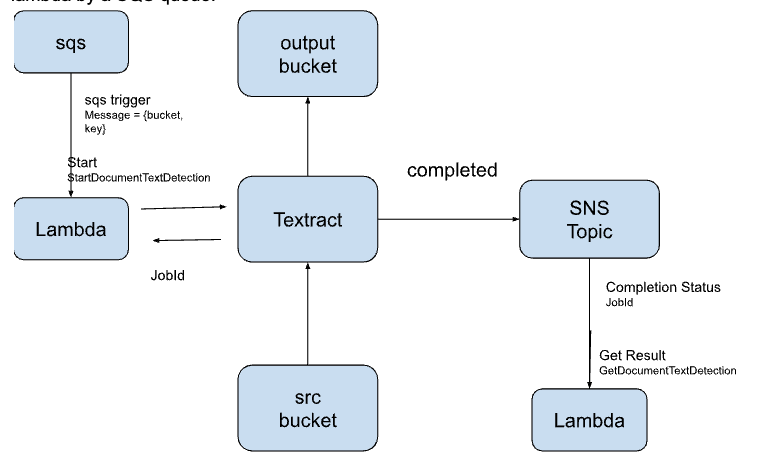

<h1>Detect text with Textract</h1>
<h2>System Design</h2>

<h2>Init Project</h2>
Use the following command to initialize a project. For more information, see the initialization documentation.  
<code>
<pre>
sam init
project name: text-detect
</pre>
</code>

<h2>Template</h2>
1 Define the start SQS queue which triggers the start lambda function. The sqs message contains the source bucket and the key.
 
 
2 Define the start lambda function which is triggered by the start sqs. The start lambda function submits the text detection start job. The start job request includes the sns topic to which textract to publish the result. It also includes the IAM role needed for textract to publish the result to sns topic and access source and destination s3 buckets. 
The start lambda should have permissions to create a textract job.
 
 
3 Define the IAM role needed by textract to publish to sns topic and access source and destination s3 buckets.
 
 
4 Define sns topic called ‘AmazonTextract-completed-notification’.
 
Note that for the ‘AmazonTextractServiceRole’ policy to work, the sns topic name must start with ‘AmazonTextract’. For more information, see the ‘AmazonTextractServiceRole’ policy definition.
 
 
5 Define the process result lambda function which is triggered by sns topic. 
This lambda should have permissions to get textract results.
 
 

<h2>Lambda</h2>
The lambda function that starts the job is in the following file. 
<code>
async-text-detection/text-detect/start/app.py
</code>
 

The lambda function that process the job result and extract words is in the following file. 
<code>
async-text-detection/text-detect/process-result/app.py
</code>

<h2>Build and deploy</h2>

Because this template creates an iam role, the following capabilities have to be provided. 
<code>
sam deploy --guided --capabilities CAPABILITY_NAMED_IAM
</code>
 
stack name: text-detect

<h2>Test</h2>

Upload a pdf file to the source bucket
Send a message to the sqs queue including the bucket name and key. 
Check if the destination bucket has the result. Also check the CloudWatch logs have the extracted words logged by the process result lambda function.
 
 
SQS Message Format
 
<code>
{"bucket":"test-src", "key":"test.docx"}
</code>
 
where bucket is the source bucket.
